# SwapBased V3 合约业务流程深度解析

> 本文档系统梳理了 `swapbased-v3-core-and-farming-contracts` 仓库中各合约从部署到用户交互的完整业务流程。

---

# 模块划分结果

## 1. 核心协议层 (Core Protocol Layer)
- **关注点**：协议骨架的搭建、交易池的物理部署、以及价格的初始化。
- **涉及合约**：
  - [PancakeV3Factory.sol](../v3-core/contracts/PancakeV3Factory.sol)
  - [PancakeV3PoolDeployer.sol](../v3-core/contracts/PancakeV3PoolDeployer.sol)
  - [PancakeV3Pool.sol](../v3-core/contracts/PancakeV3Pool.sol)
- **核心流程**：工厂部署、费率档设置、创建交易池（CREATE2）、初始化初始价格。

## 2. 仓位与流动性管理层 (Position & Liquidity Management Layer)
- **关注点**：用户如何"质押"代币（提供流动性）并获得 NFT 凭证，以及后续的仓位调整。
- **涉及合约**：
  - [NonfungiblePositionManager.sol](../v3-periphery/contracts/NonfungiblePositionManager.sol)
  - [LiquidityManagement.sol](../v3-periphery/contracts/base/LiquidityManagement.sol)
  - [PeripheryPayments.sol](../v3-periphery/contracts/base/PeripheryPayments.sol)
- **核心流程**：Mint NFT（开仓）、增加/减少流动性、提取交易手续费（Collect）、销毁 NFT（关仓）。

## 3. 交易路由与迁移层 (Swap Routing & Migration Layer)
- **关注点**：代币兑换的执行路径，以及从旧版本（V2）向新版本的平滑过渡。
- **涉及合约**：
  - [SwapRouter.sol](../v3-periphery/contracts/SwapRouter.sol)
  - [V3Migrator.sol](../v3-periphery/contracts/V3Migrator.sol)
- **核心流程**：单跳/多跳交易（ExactInput/Output）、V2 LP Token 销毁并自动迁移至 V3 仓位。

## 4. 元数据与展示层 (Metadata & Descriptor Layer)
- **关注点**：NFT 的外观描述、链上/链下元数据生成。
- **涉及合约**：
  - [NonfungibleTokenPositionDescriptor.sol](../v3-periphery/contracts/NonfungibleTokenPositionDescriptor.sol)
  - [NFTDescriptorEx.sol](../v3-periphery/contracts/NFTDescriptorEx.sol)
  - OffChain 系列描述符
- **核心流程**：生成 tokenURI、构建 SVG 图形、解析代币名称与符号。

---

# 模块 1：核心协议层 (Core Protocol Layer)

核心协议层是整个 V3 体系的基石，主要负责"工厂的建立"和"交易池的物理创建"。V3 采用了 `CREATE2` 确定性地址算法，使得池地址可以根据 `(token0, token1, fee)` 离线预推导。

## 1.1 部署与握手流程 (Deployment & Handshake)

在 V3 中，工厂和部署器是分离的。为了防止构造函数参数过大导致的 Gas 限制，它们采用了"回调读取参数"的独特握手方式。

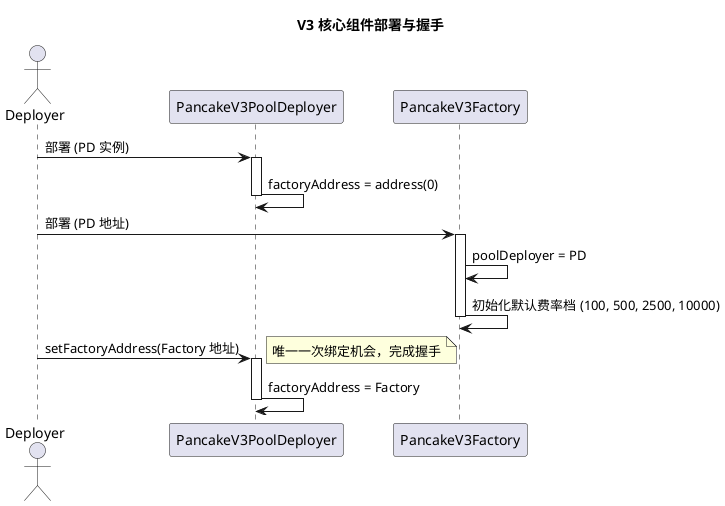

## 1.2 创建交易池流程 (Pool Creation)

这是 `Factory` 最核心的功能。它不直接 `new Pool`，而是通过 `PD.deploy` 间接创建，以确保 Salt 的纯净性。

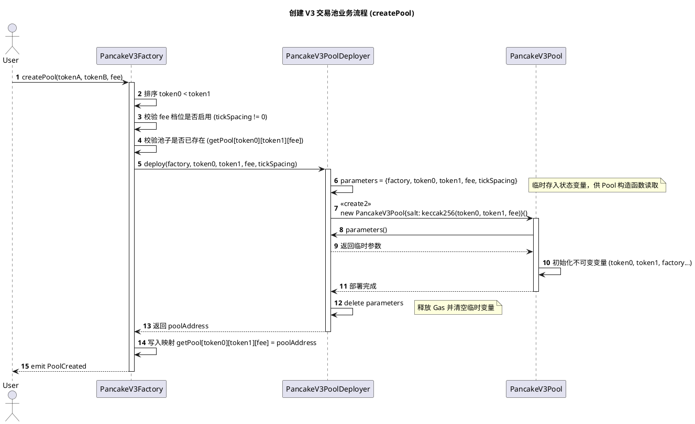

## 1.3 初始化价格流程 (Pool Initialization)

池子刚部署时，`sqrtPriceX96` 为 0，此时无法进行任何交易。必须由第一位注入流动性的用户或项目方进行初始化。

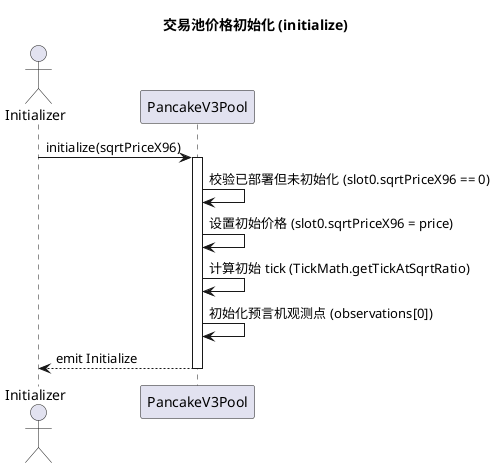

## 1.4 核心函数清单与使用场景

| 合约 | 核心函数 | 使用场景 | 作用说明 |
| :--- | :--- | :--- | :--- |
| [PancakeV3Factory](../v3-core/contracts/PancakeV3Factory.sol) | `createPool()` | 上新交易对 | 校验参数后通过 Deployer 创建唯一的交易池实体。 |
| [PancakeV3Factory](../v3-core/contracts/PancakeV3Factory.sol) | `enableFeeAmount()` | 协议升级 | 新增一种费率与 Tick 间距的组合（如自定义 0.01% 费率）。 |
| [PancakeV3PoolDeployer](../v3-core/contracts/PancakeV3PoolDeployer.sol) | `deploy()` | 内部调用 | 负责执行底层 `CREATE2` 操作，是计算池地址的唯一权威来源。 |
| [PancakeV3Pool](../v3-core/contracts/PancakeV3Pool.sol) | `initialize()` | 首次建池后 | 设定池子的初始挂牌价。此步骤完成后，池子才具备"生命力"。 |

## 1.5 模块 1 设计原理总结

这一层的设计极其精巧，通过 **分离部署器 (Deployer)** 解决了合约代码量上限（Contract Size Limit）的问题，并利用 **临时参数存储** 实现了无参数构造函数的池部署，从而保证了链上地址计算的确定性。

---

# 模块 2：仓位与流动性管理层 (Position & Liquidity Management Layer)

仓位管理层是用户与 V3 合约交互最频繁的部分。它负责将用户的"提供流动性"行为转化为链上可验证的 NFT 凭证（Position）。

## 2.1 Mint NFT（开仓 / 初次质押）

这是用户首次向某交易对提供流动性时触发的流程。用户不直接与池子交互，而是通过 `NonfungiblePositionManager`（NPM）来完成操作。

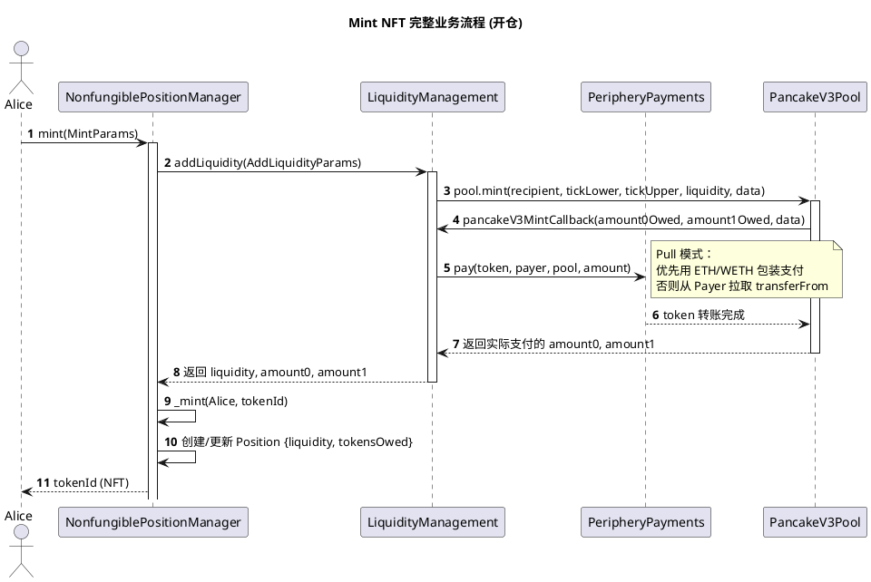

## 2.2 增加流动性 (Increase Liquidity)

对于已有仓位的用户，可以随时向同一区间追加更多的流动性。

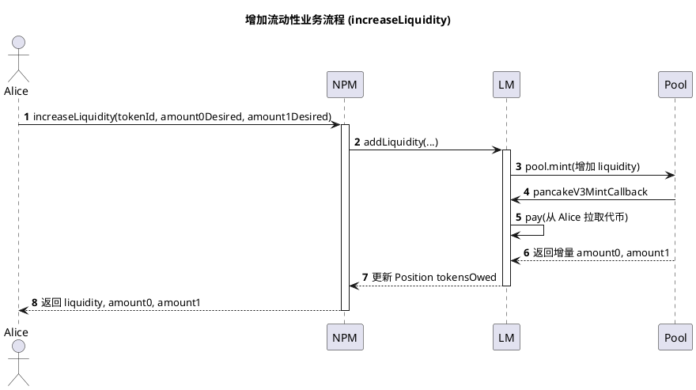

## 2.3 减少流动性 (Decrease Liquidity)

当用户想要"部分退出"或"完全退出"流动性时，需要先将仓位中"应计但未结算"的交易手续费提取，然后再减少流动性。

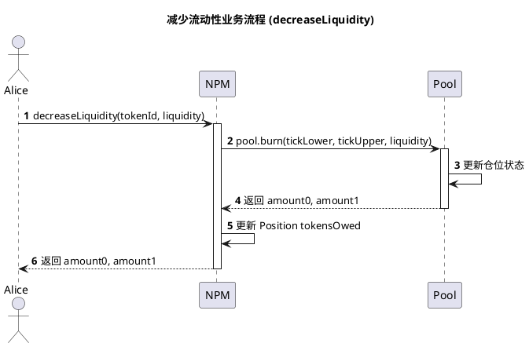

## 2.4 提取交易手续费 (Collect)

V3 的独特之处在于：流动性提供者在提供流动性期间产生的交易手续费，不会自动归于他，而是存在合约中等待领取。

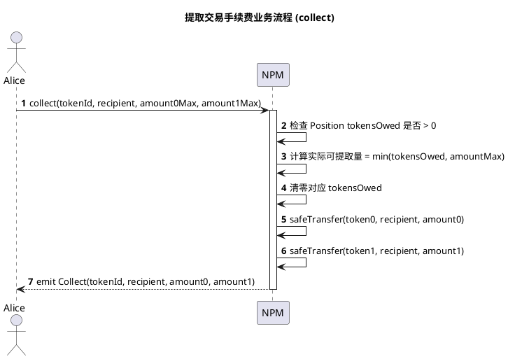

## 2.5 销毁 NFT（关仓 / 退出质押）

完全退出意味着用户不仅取回了所有流动性本金，还取回了所有应计的交易手续费。

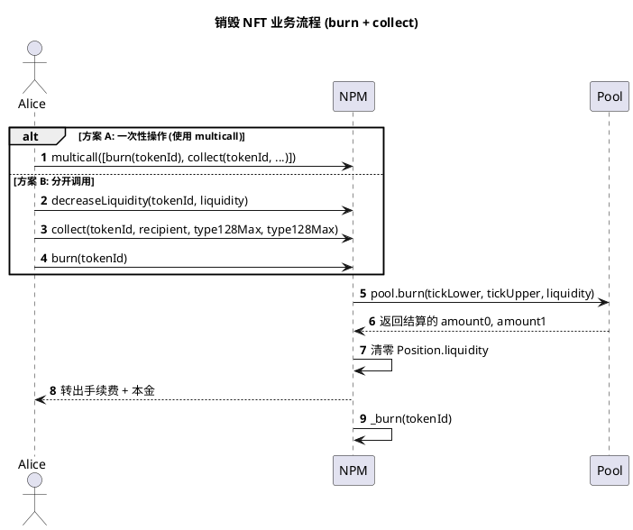

## 2.6 核心函数清单与使用场景

| 合约 | 核心函数 | 使用场景 | 作用说明 |
| :--- | :--- | :--- | :--- |
| [NonfungiblePositionManager](../v3-periphery/contracts/NonfungiblePositionManager.sol) | `mint()` | 首次提供流动性 | 存入代币，获取代表仓位的 NFT (tokenId)。 |
| [NonfungiblePositionManager](../v3-periphery/contracts/NonfungiblePositionManager.sol) | `increaseLiquidity()` | 追加流动性 | 在已有仓位上增加流动性。 |
| [NonfungiblePositionManager](../v3-periphery/contracts/NonfungiblePositionManager.sol) | `decreaseLiquidity()` | 减少流动性 | 从仓位中移除流动性，但不离场。 |
| [NonfungiblePositionManager](../v3-periphery/contracts/NonfungiblePositionManager.sol) | `collect()` | 提取手续费 | 领取累积的交易手续费（可能含本金）。 |
| [NonfungiblePositionManager](../v3-periphery/contracts/NonfungiblePositionManager.sol) | `burn()` | 关闭仓位 | 销毁 NFT，完全退出流动性。 |
| [LiquidityManagement](../v3-periphery/contracts/base/LiquidityManagement.sol) | `addLiquidity()` | 内部计算 | 根据当前价格与 Tick 区间计算实际注入的 liquidity。 |
| [LiquidityManagement](../v3-periphery/contracts/base/LiquidityManagement.sol) | `pancakeV3MintCallback()` | 内部回调 | 池子向本合约请求付款时的钩子，实现 Pull 付款模式。 |
| [PeripheryPayments](../v3-periphery/contracts/base/PeripheryPayments.sol) | `pay()` | 内部付款 | 统一支付入口：优先用 ETH Wrap 付，其次合约余额，最后 Pull。 |
| [PeripheryPayments](../v3-periphery/contracts/base/PeripheryPayments.sol) | `unwrapWETH9()` | 提 ETH | 将 WETH 拆包为 ETH 提给用户。 |
| [PeripheryPayments](../v3-periphery/contracts/base/PeripheryPayments.sol) | `sweepToken()` | 清余额 | 将合约残留的 ERC20 全部转给用户。 |

## 2.7 模块 2 设计原理总结

V3 流动性管理的核心是 **"流动性状态在核心池，仓位凭证在 NPM (ERC721)"** 的分离设计。手续费通过 `tokensOwed` 字段延迟结算，这允许用户在不关闭仓位的情况下先取走收益，保持仓位不变。

---

# 模块 3：交易路由与迁移层 (Swap Routing & Migration Layer)

## 3.1 单跳 Exact Input 交易

用户想要精确输入代币数量，换取最小输出的代币。

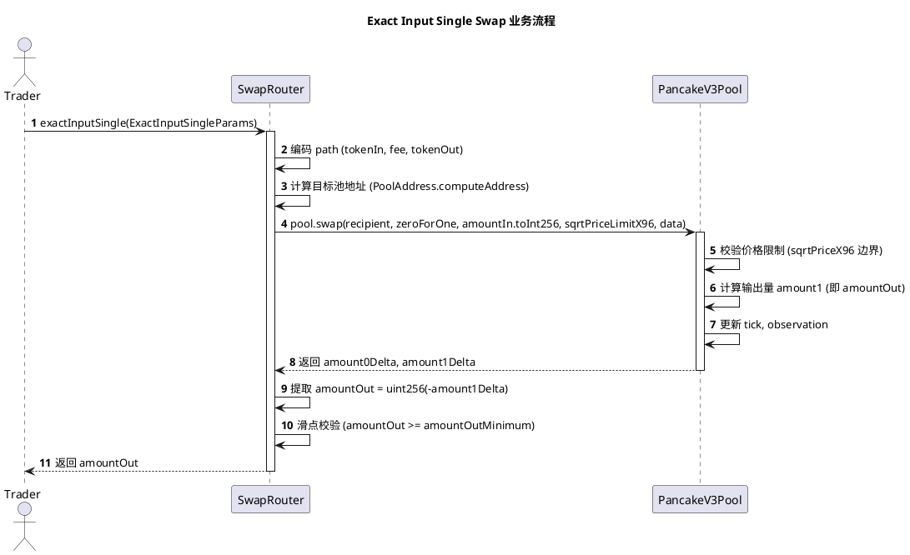

## 3.2 多跳交易 (Multi-hop)

当不存在直接的交易对时，Router 会自动拆分多个单跳操作。

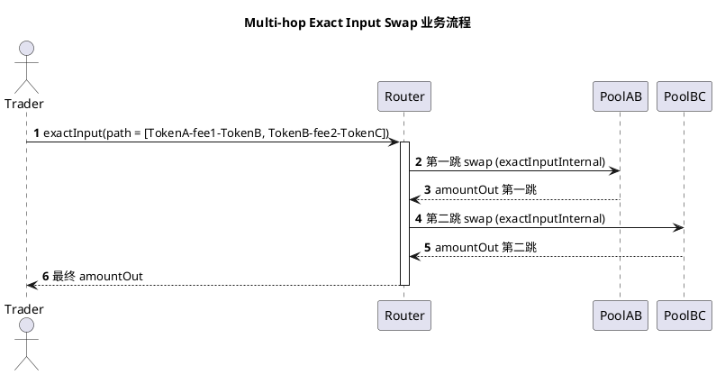

## 3.3 V2 向 V3 迁移 (Migration)

当用户持有 V2 LP Token 并想升级到 V3 时，`V3Migrator` 会自动完成"销毁 V2 - 计算比例 - 转换为 V3 仓位"的流程。

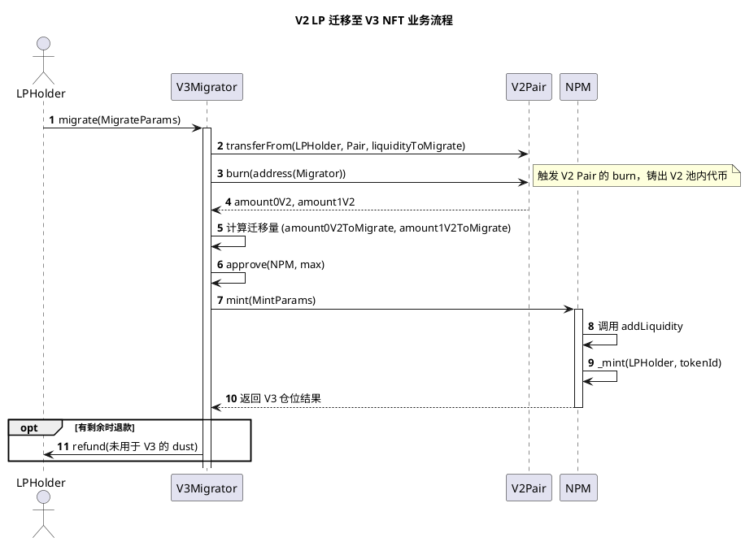

## 3.4 核心函数清单与使用场景

| 合约 | 核心函数 | 使用场景 | 作用说明 |
| :--- | :--- | :--- | :--- |
| [SwapRouter](../v3-periphery/contracts/SwapRouter.sol) | `exactInputSingle()` | 单跳精确输入兑换 | 用户用固定量 TokenA 换最小量 TokenB。 |
| [SwapRouter](../v3-periphery/contracts/SwapRouter.sol) | `exactOutputSingle()` | 单跳精确输出兑换 | 用户想获得固定量 TokenB，最多付多少由滑点保护。 |
| [SwapRouter](../v3-periphery/contracts/SwapRouter.sol) | `exactInput()` / `exactOutput()` | 多跳兑换 | 跨多个池子的路径自动拆分与执行。 |
| [SwapRouter](../v3-periphery/contracts/SwapRouter.sol) | `pancakeV3SwapCallback()` | 回调入口 | 池子在 swap 后回调本合约，触发 pay 逻辑付款给池子。 |
| [V3Migrator](../v3-periphery/contracts/V3Migrator.sol) | `migrate()` | V2 升级 | 将 V2 LP 按比例迁移为 V3 NFT 仓位，支持部分迁移。 |

## 3.5 模块 3 设计原理总结

V3 的 Router 设计强调 **"无状态路由"**，即 Router 本身不管理资金，只负责转发请求和聚合结果。而 `V3Migrator` 则解决了协议升级中最棘手的"流动性迁移"问题，让用户可以一键完成从旧世界到新世界的过渡。

---

# 模块 4：元数据与展示层 (Metadata & Descriptor Layer)

## 4.1 NFT 元数据生成流程

每个仓位 NFT 的 `tokenURI` 描述了该仓位的关键信息（代币对、费率区间、当前价格等）。

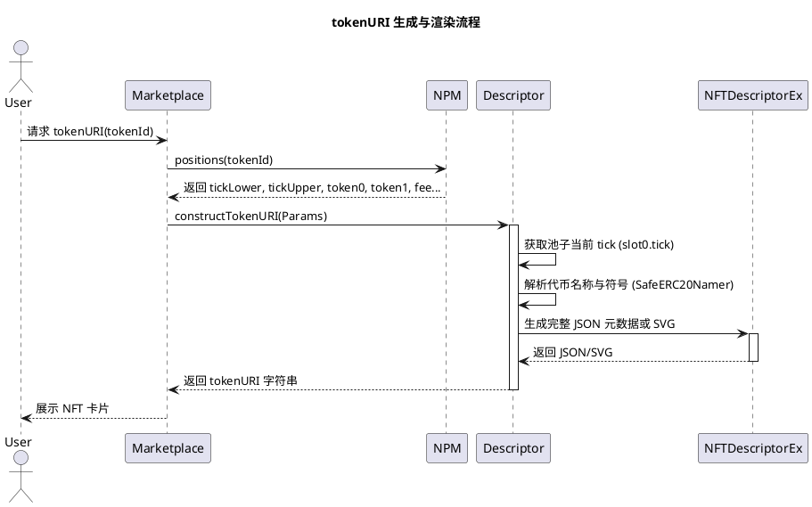

## 4.2 Off-chain 描述符

对于只想简单展示的项目方，可以使用 `NonfungibleTokenPositionDescriptorOffChain`，将元数据托管到链下服务器。

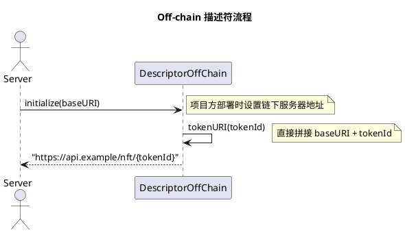

## 4.3 核心函数清单与使用场景

| 合约 | 核心函数 | 使用场景 | 作用说明 |
| :--- | :--- | :--- | :--- |
| [NonfungibleTokenPositionDescriptor](../v3-periphery/contracts/NonfungibleTokenPositionDescriptor.sol) | `tokenURI()` | 链上生成元数据 | 实时从链上读取池子状态，生成动态 NFT 描述。 |
| [NFTDescriptorEx](../v3-periphery/contracts/NFTDescriptorEx.sol) | `constructTokenURI()` | SVG 图形构建 | 生成包含仓位可视化图形的 SVG 图像。 |
| [NonfungibleTokenPositionDescriptorOffChain](../v3-periphery/contracts/NonfungibleTokenPositionDescriptorOffChain.sol) | `tokenURI()` | 链下托管 | 简单返回拼接的 URI，适合大型项目自定义展示。 |

## 4.4 模块 4 设计原理总结

元数据层的设计体现了 V3 的灵活性：项目方可以选择完全去中心化的链上生成方式，也可以选择灵活的链下服务器托管方式，且两种方式都遵循统一的 `INonfungibleTokenPositionDescriptor` 接口标准。

---

*文档生成完毕*
