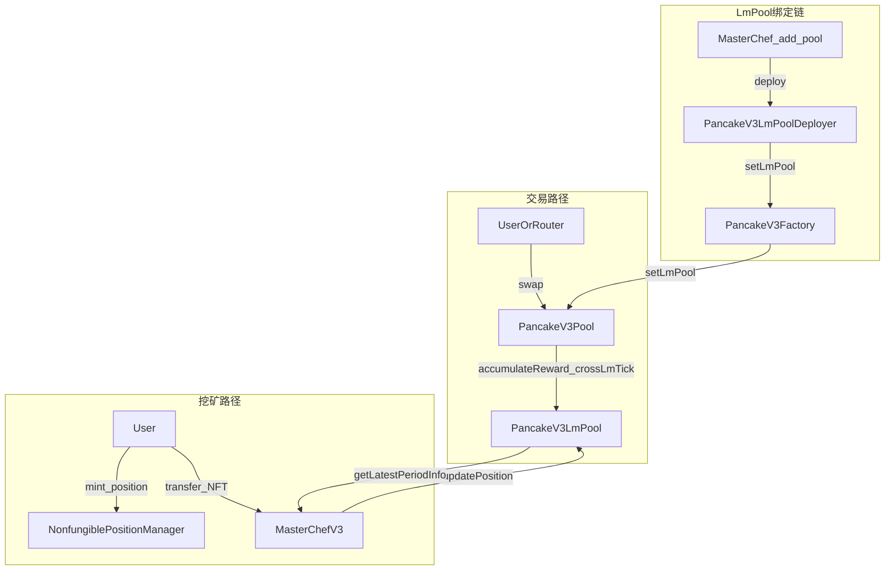

# SwapBased V3 Core & Farming 合约 — 面试学习指南

本文档面向**把本仓库学到能应对技术面试**的目标读者：先用白话讲清**整体架构与设计动机**，再下沉到**核心机制与实现细节**，最后整理**高频面试问答**。

> **仓库本质**：在 **Uniswap V3 / PancakeSwap V3 风格的集中流动性 AMM** 之上，叠加 **V3 流动性挖矿（LM）** 与 **MasterChef 式农场**。核心交易与头寸逻辑在 `v3-core` / `v3-periphery`；挖矿记账在 `v3-lm-pool`；用户质押 NFT、领取奖励在 `masterchef-v3`；`router` 提供聚合路由（V2/V3/稳定币池等）。

> **完整版维护位置**：本文件为唯一长篇正文；若你从旧链接打开 `[docs/面试学习指南-SwapBased-V3与流动性挖矿.md](docs/面试学习指南-SwapBased-V3与流动性挖矿.md)`，该文件仅保留指向本路径的说明。

---

## 一、先从「一张图」理解项目在做什么

### 1.1 用户视角的两条主路径


| 路径           | 做什么                                      | 主要合约                                                                       |
| ------------ | ---------------------------------------- | -------------------------------------------------------------------------- |
| **交易（Swap）** | 按路径在一个或多个池子里换 Token                      | `v3-periphery` 的 `SwapRouter`，或 `router` 里的 `SmartRouter` / `V3SwapRouter` |
| **做市 + 挖矿**  | 在 NPM 里建 V3 头寸（NFT）→ 把 NFT 存进农场赚额外 Token | `NonfungiblePositionManager` + `MasterChefV3` + `PancakeV3LmPool`          |


### 1.2 分层架构（由里到外）

```
┌─────────────────────────────────────────────────────────────┐
│  router（SmartRouter 等）  聚合 V2 / V3 / Stable 路由，优化用户体验      │
├─────────────────────────────────────────────────────────────┤
│  v3-periphery   NPM、SwapRouter、Quoter、Multicall、Permit 等           │
├─────────────────────────────────────────────────────────────┤
│  v3-core        PancakeV3Factory / PancakeV3Pool（单池状态机 + AMM 数学）   │
├─────────────────────────────────────────────────────────────┤
│  v3-lm-pool     PancakeV3LmPool：仅负责「挖矿奖励」的累计与 Tick 维度分账     │
├─────────────────────────────────────────────────────────────┤
│  masterchef-v3  MasterChefV3：池子权重、NFT 托管、boost、领取、多奖励铸造等   │
└─────────────────────────────────────────────────────────────┘
```

### 1.3 数据流简图（Pool / LmPool / MasterChef）

下图帮助记忆：**交易**驱动 Pool 与 LmPool 同步跨 tick；**农场**只通过 MasterChef 改 LmPool 头寸；**绑定** LmPool 到 Pool 必须经过 Factory 授权。




**设计思路一句话**：  

- **Core 池子**只关心「价格、流动性、交易手续费」——与 Uniswap V3 同构。  
- **LmPool** 平行维护一套 **rewardGrowth**（类似 `feeGrowth`），使得「谁在某价位区间提供了多少**有效挖矿流动性**」可公平累计。  
- **MasterChef** 负责运营层：分配 `allocPoint`、托管 ERC721、调 NPM 加减流动性、把奖励按配置 **mint** 给用户。

---

## 二、仓库目录与依赖关系（面试常问「代码在哪」）


| 目录              | 职责                                 | Solidity 版本（典型） |
| --------------- | ---------------------------------- | --------------- |
| `v3-core`       | 工厂、池子、Tick/Position/Oracle 数学      | `0.7.6`         |
| `v3-periphery`  | 头寸 NFT、路由、报价、Lens                  | `0.7.6`         |
| `v3-lm-pool`    | `PancakeV3LmPool` + `LmTick` 库     | `0.7.6`         |
| `masterchef-v3` | `MasterChefV3`、与 NPM/LMPool 交互     | `^0.8.10`       |
| `router`        | `SmartRouter` 继承 V2/V3/Stable 路由能力 | `0.7.6`         |


### 2.1 Factory 默认费率与 tickSpacing

构造函数中为常用档位初始化（与 `[v3-core/contracts/PancakeV3Factory.sol](v3-core/contracts/PancakeV3Factory.sol)` 一致；单位：fee 为**百分之一基点**量级，即 100 表示 0.01%）：


| fee（uint24） | tickSpacing（int24） | 常见对应    |
| ----------- | ------------------ | ------- |
| 100         | 1                  | 0.01% 档 |
| 500         | 10                 | 0.05% 档 |
| 2500        | 50                 | 0.25% 档 |
| 10000       | 200                | 1% 档    |


Owner 还可通过 `enableFeeAmount` 新增档位；部分档位可配置白名单与启用开关（`feeAmountTickSpacingExtraInfo`）。

**为何 MasterChef 用 0.8 而 Core 用 0.7？**  
部署器注释里写明：LM 部署与 MasterChef 逻辑若在旧版本里内联合约体积/编译约束更麻烦，故 **LmPool 由独立部署器在 0.7 环境部署**，MasterChef 用 0.8 享受更现代的语法与安全特性，通过接口交互即可。

---

## 三、核心概念：集中流动性 AMM（与 Uniswap V3 对齐）

### 3.1 集中流动性（Concentrated Liquidity）

- 流动性不是「整段曲线平均分配」，而是附着在 **tickLower, tickUpper)** 上。  
- 当前价落在区间内时，头寸「在范围内」；价穿出区间则头寸变为 **100% 单币**（和 V3 一致）。

### 3.2 价格表示：sqrtPriceX96

- 链上用 **\sqrt{P}** 的定点数（×2^96）表示价格，避免开方与提高精度。  
- **Tick** 是价格的离散化：每个 tick 对应一个可接受的 \sqrt{P}。

### 3.3 全局手续费增长 feeGrowthGlobal

- 每笔 swap 产生手续费；按 **当前激活流动性** 分摊到 **feeGrowthGlobal0/1**。  
- 每个头寸用 **feeGrowthInside** 与 **feeGrowthInsideLast** 的差结算应得手续费——这是 V3 的标配面试点。

### 3.4 Swap 是「分段 + 跨 Tick」的状态机

池子 `swap` 循环：找下一个初始化 tick → `SwapMath.computeSwapStep` → 若到达 tick 则 **cross tick**（更新流动性 net）。

---

## 四、本项目的「增量」：流动性挖矿如何接进 Core

### 4.1 为什么在池子里挂 `lmPool`？

`PancakeV3Pool` 增加状态 `IPancakeV3LmPool public lmPool`，并在 `**swap` 路径**里与主池同步：

1. **每次 swap 开始**：若已绑定 LmPool，先 `accumulateReward(blockTimestamp)`，按时间把全局奖励摊到 `rewardGrowthGlobalX128`（分母用 **lmLiquidity**）。
2. **每次跨过初始化 tick**：在主池 `ticks.cross` 之后，再调用 `lmPool.crossLmTick(tickNext, zeroForOne)`，更新 **挖矿侧**的 tick 净流动性。

这样保证：**交易推动价格移动时，挖矿侧的「有效流动性」与主池一致地跨 tick**，不会出现「主池流动性变了，挖矿还按旧状态分奖励」的长期偏差。

对应代码位置（逻辑要点）：

- `swap` 开头：`accumulateReward`  
- 跨 tick 分支：`crossLmTick` 与 `ticks.cross` 成对出现

### 4.2 PancakeV3LmPool 做什么？

- `**rewardGrowthGlobalX128`**：全局每单位流动性的奖励累计（类比 feeGrowth）。  
- `**lmTicks` + `LmTick` 库**：维护每个 tick 上的 **liquidityGross / liquidityNet / rewardGrowthOutside**，从而能算 `**getRewardGrowthInside(lower, upper)`**。  
- `**updatePosition`**：仅允许 **MasterChef** 调用，在用户质押/调整/boost 时，对 `[tickLower, tickUpper)` 更新 **boost 后的有效流动性**（`liquidityDelta`）。

### 4.3 为何单独 `PancakeV3LmPoolDeployer`？授权链是什么？

Solidity 版本不兼容时，把 **部署 LmPool** 与 **回写 Pool** 拆到独立合约里实现。流程如下：

1. **MasterChef** `add` 新矿池时调用 `**ILMPoolDeployer.deploy(v3Pool)`**（实现类即 `PancakeV3LmPoolDeployer`）。
2. **Deployer** `onlyMasterChef`：`new PancakeV3LmPool(pool, masterChef, ...)`，随后调用 `**PancakeV3Factory.setLmPool(pool, lmPool)`**。
3. **Factory** `setLmPool` 使用修饰符 `**onlyOwnerOrLmPoolDeployer`**：仅 工厂 owner 或 已登记的 `lmPoolDeployer` 地址 可调用。因此普通用户**不能**把任意合约绑到任意池上。
4. Factory 内部再调 `**PancakeV3Pool.setLmPool(lmPool)`**；Pool 侧为 `**onlyFactoryOrFactoryOwner`**，即只有 Factory 或 Factory owner 能改 `lmPool` 指针。

**面试一句话**：恶意 LM 无法随意绑定，除非攻破工厂 owner、或冒充已注册的 lmPoolDeployer、或 Factory owner 作恶。

---

## 五、MasterChefV3：运营与用户的粘合层

### 5.1 池子信息 `PoolInfo`

- 关联 **V3 池地址**、token0/token1、fee、**allocPoint**、总流动性统计、**多奖励代币比例与地址**。  
- `v3PoolPid` / `v3PoolAddressPid`：由 (token0, token1, fee) 或池地址查 **pid**。

### 5.2 用户质押：NFT 转给 MasterChef

- 用户把 **Pancake V3 Positions NFT** `safeTransfer` 到 `MasterChefV3`。  
- `onERC721Received` 校验：来自 NPM、流动性非零、该池已 `add` 且存在 LmPool。  
- 写入 `userPositionInfos[tokenId]`，并 `**LMPool.updatePosition`** 把该头寸的 **boost 流动性**计入 LM。

### 5.3 奖励计算（与 V2 MasterChef「份额」类比）

- 每个头寸记录 `**rewardGrowthInside` 快照**与 `**boostLiquidity`**。  
- **pending**：\Delta \text{rewardGrowthInside} \times \text{boostLiquidity} / 2^{128}（见 `Q128` 常量用法），再加已结算的 `reward`。  
- **boost**：`boostLiquidity = liquidity * boostMultiplier / BOOST_PRECISION`，由外部 `FarmBooster` 可更新。

### 5.4 全局排放与周期

- `globalCakePerSecond`、`totalAllocPoint` 决定每池 `cakePerSecond`。  
- `upkeep` 等函数维护周期起止时间；LmPool 的 `accumulateReward` 从 MasterChef `**getLatestPeriodInfo`** 读当前每秒奖励（再按本池 `allocPoint` 已在别处体现到全局公式——读代码时注意 `getLatestPeriodInfo` / `getLatestPeriodInfoByPid`）。

### 5.5 多奖励发放

`_safeTransfer` 按 `rewardsRatio` 与 `rewardsAddresses` **循环 mint** 多种 ERC20（需实现 `mint` 接口）。面试可讲：这是相对单币 CAKE 的扩展点。

### 5.6 与 NPM 的组合调用

- `increaseLiquidity` / `decreaseLiquidity`：先给用户转 token 再调 NPM，再 `harvestOperation` + `updateLiquidityOperation` 同步 LM。  
- `collect`：手续费从 NPM 收到 MasterChef 再 `collectTo` 转回用户——注意注释里 **recipient 为 0 时的资金风险**。

---

## 六、外围与路由（面试「和 Core 什么关系」）

### 6.1 NonfungiblePositionManager（NPM）

- 把 `(token0, token1, fee, tickLower, tickUpper)` 头寸封装成 **ERC721**。  
- 用户与池子的 `mint`/`swap` 通过 **callback** 完成代币交割（`pancakeV3MintCallback` / `pancakeV3SwapCallback` 命名与 Uniswap 的 `uniswapV3`* 对应，属品牌命名差异）。

### 6.2 SwapRouter（v3-periphery）

- `exactInput` / `exactOutput` 多跳路径编码在 `bytes path` 里。  
- 回调里 `verifyCallback` 确保 **只有真实池子**能调用 router 支付。

### 6.3 SmartRouter（router）

- 继承 `V2SwapRouter`、`V3SwapRouter`、`StableSwapRouter` 等，**一条交易内可混 V2/V3/稳定币**，适合产品层做「最优路径」。

---

## 七、安全与工程向考点（高频）

1. **重入**：池子用 `lock`/`unlocked`；MasterChef 用 `ReentrancyGuard`；swap 先改状态再回调。
2. **回调鉴权**：Router 必须校验调用方是否为**预期池地址**（deployer + CREATE2 地址计算）。
3. **价格操纵**：TWAP/Oracle 在 `observations`；面试常考「单块闪电贷能否操纵 TWAP」。
4. **LmPool 与主池一致性**：跨 tick 顺序、`accumulateReward` 时间戳单调。
5. **权限**：`setLmPool` 限制 factory owner / lmPoolDeployer；池子 `setLmPool` 仅 factory 侧触发。
6. **整数与精度**：FullMath、FixedPoint128、SafeCast；`liquidity` 用 `uint128` 等。

---

## 八、面试问答速查（建议背诵逻辑，不必背代码行号）

### A. 架构类

**Q：这个仓库和 Uniswap V3 什么关系？**  
**A：** AMM 核心（集中流动性、tick、swap 分段、手续费增长）与 Uniswap V3 **同构**；本仓库在池子中嵌入 **LmPool 钩子**，并增加 **MasterChef + NFT 质押** 做流动性激励。

**Q：为什么挖矿不直接改 Pool 里的 positions？**  
**A：** 交易手续费与挖矿激励是两种经济逻辑；用独立 `rewardGrowth` 与 **MasterChef 托管 NFT** 解耦，便于改排放、boost、多奖励，而不破坏 Core 的最小攻击面。

**Q：SmartRouter 和 SwapRouter 区别？**  
**A：** `SwapRouter` 专注 V3 路径；`SmartRouter` 再聚合 **V2、稳定币池** 等，面向「一键换币」产品体验。

### B. AMM 数学与实现

**Q：为什么用 sqrtPrice 而不是价格？**  
**A：** 恒定乘积在集中流动性公式里用 \sqrt{P} 更稳；链上定点避免浮点。

**Q：feeGrowth 怎么对应到用户手续费？**  
**A：** 用区间内 `feeGrowthInside` 与上次记录的差，乘以流动性，再扣减已计入 `tokensOwed` 的部分（标准 V3 叙述）。

**Q：swap 何时跨 tick？**  
**A：** 当本轮计算到达下一个初始化 tick 的价格边界时，执行 tick 切换并更新流动性；本仓库在跨 tick 时额外调用 `**crossLmTick`**。

### C. 流动性挖矿

**Q：reward 如何随 swap 更新？**  
**A：** 每次 swap 先 `accumulateReward` 按时间累加全局 `rewardGrowthGlobal`；跨 tick 时更新 **lm 侧** net liquidity，保证 **rewardGrowthInside** 与当前区间一致。

**Q：boost 影响什么？**  
**A：** 影响计入 LmPool 的 **boostLiquidity**，从而同区间里「有效算力」不同，奖励不同。

**Q：用户怎么领奖励？**  
**A：** 调 `harvest`；内部先 `accumulateReward` 再算增量，最后按配置 **mint** 多种奖励代币。

### D. 细节与陷阱

**Q：池子的 `lock` 修饰符解决什么问题？**  
**A：** 防止重入；swap/mint 等依赖余额差检测付款，必须单线程进入。

**Q：为何 `onERC721Received` 里要 `updateLiquidityOperation`？**  
**A：** 质押时需把该 NFT 对应区间流动性登记到 LmPool，并记录 `rewardGrowthInside` 初始快照。

**Q：谁能给池子绑定恶意 LmPool？**  
**A：** 需为 **Factory owner** 或 Factory 登记的 `**lmPoolDeployer`**；Deployer 合约仅接受 **MasterChef** 调用 `deploy`。普通用户无法任意绑定。

---

## 九、推荐阅读顺序（上手代码）

1. `v3-core/contracts/PancakeV3Factory.sol` → `PancakeV3Pool.sol` 中 `swap` 与 `lmPool` 相关片段。
2. `v3-lm-pool/contracts/PancakeV3LmPool.sol` + `libraries/LmTick.sol`。
3. `v3-lm-pool/contracts/PancakeV3LmPoolDeployer.sol`（部署与 `setLmPool` 全流程）。
4. `masterchef-v3/contracts/MasterChefV3.sol`：`add`、`onERC721Received`、`harvest`、`updateLiquidityOperation`。
5. `v3-periphery/contracts/NonfungiblePositionManager.sol`、`SwapRouter.sol`（回调与路径）。
6. `router/contracts/SmartRouter.sol`（聚合能力）。

---

## 十、附录：与官方 Uniswap V3 文档的对照

- **概念不理解时**：优先查阅 Uniswap V3 白皮书与官方文档（集中流动性、tick、fee growth、oracle）。  
- **本仓库差异点**：重点只看 `**lmPool` 三处钩子**、**LmTick 与 Tick 平行结构**、**MasterChef 与 NPM 的组合流程**。

---

*文档生成自当前仓库源码结构分析；若你后续升级合约版本或改动经济模型，请以链上部署地址与最新 `README`/审计报告为准。*